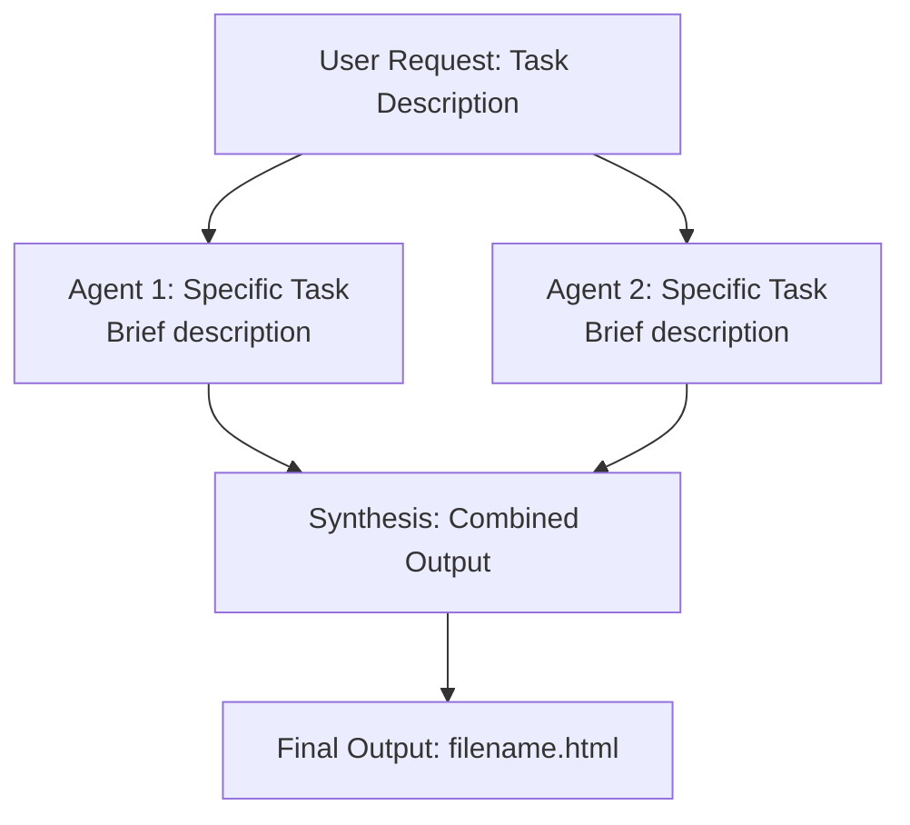

<subagent_viz>
# Subagent Dependency Graph Visualization

**VERIFICATION_HASH:** `2e02f5c31a97033c`


When the user mentions "subagent(s)" in context of wanting to visualize or summarize what happened, create a comprehensive task dependency graph and workflow visualization.

## What to Create

Generate an interactive HTML file named `claude_agent_workflow_[task_name].html` that includes:

### 1. Mermaid Dependency Graph

Create a flowchart showing:
- Initial user request as starting node
- Each agent launched as a node with task description
- Dependencies between agents (parallel vs. sequential)
- Synthesis/aggregation step if applicable
- Final output node

Use color coding:
- `:::launched` - Sky blue (#87CEEB) for initial tasks
- `:::running` - Gold (#FFD700) for in-progress
- `:::completed` - Light green (#90EE90) for finished agents
- `:::synthesized` - Plum (#DDA0DD) for synthesis/output

Example structure:


### 2. Execution Statistics Dashboard

Display key metrics in a grid:
- Number of agents launched
- Number completed successfully
- Success rate percentage
- Execution mode (Parallel/Sequential/Mixed)
- Total tokens used
- Output word count
- Processing time (if available)

### 3. Task Detail Cards

For each agent, create an expandable card containing:

**Card Header:**
- Status indicator dot (color-coded)
- Agent number and title
- Agent type badge (general-purpose, specialized, etc.)

**Card Content:**
- Clear task description
- Task tags (research, analysis, empirical, etc.)
- Collapsible "Key Findings" section with:
  - Main discoveries
  - Data points found
  - Patterns identified
  - Limitations encountered

**Layout:** Use grid layout with 2-3 columns depending on number of agents

### 4. Synthesis Process Section

Explain how findings were combined:
- **Execution Strategy:** Why parallel vs sequential
- **Data Integration:** How outputs were merged
- **Cross-Validation:** Where agents reinforced each other
- **Conflict Resolution:** How contradictions were handled
- **Output Generation:** Final format and structure

### 5. Dependency Analysis

Provide insights on:
- Which tasks were independent (could run in parallel)
- Which had dependencies (required sequential execution)
- Critical path through the workflow
- Bottlenecks or waiting points
- Efficiency gains from parallelization

### 6. Key Insights Section

Highlight:
- ✓ Strengths of the approach used
- ⚠ Challenges encountered
- 💡 Lessons learned
- 🎯 Recommendations for future similar tasks

## Styling Requirements

Use Chinese aesthetic with these CSS variables:
```css
:root {
    --chinese-red: #8B0000;
    --chinese-gold: #FFD700;
    --ink-black: #1a1a1a;
    --paper-beige: #F5F5DC;
    --light-cream: #FFFEF0;
}
```

**Layout principles:**
- Full-width design with no side margins
- Compact, information-dense presentation
- Hierarchical typography (h1: 24px, h2: 17px, h3: 14px)
- Collapsible sections for progressive disclosure
- Grid layouts for cards and statistics
- Interactive elements with hover states

## Information to Gather

Before generating, ask the user (or infer from context):

1. **How many agents were launched?**
2. **What was each agent's specific task?**
3. **What agent type was used?** (general-purpose, specialized, etc.)
4. **Were they parallel, sequential, or mixed?**
5. **What were the key findings from each?**
6. **Was there a synthesis step?**
7. **What was the final output?**

If information is missing, make reasonable inferences based on:
- Tool calls visible in conversation history
- Task tool invocations with descriptions
- Agent responses and outputs
- Context of the user's request

## Generation Steps

1. **Analyze Context:** Review recent conversation for Task tool usage
2. **Extract Metadata:** Identify agents, tasks, dependencies, findings
3. **Structure Data:** Organize into visualization components
4. **Generate HTML:** Create complete interactive document
5. **Write File:** Save as `claude_agent_workflow_[descriptive_name].html`
6. **Open in Browser:** Use `open` command (macOS) or appropriate for OS
7. **Confirm to User:** Show filename and summarize what was created

## Example Trigger Phrases

User says:
- "Can you visualize the subagents you launched?"
- "Show me a dependency graph of the subagent tasks"
- "Summarize what the subagents found"
- "Create a workflow diagram for those agents"
- "I want to see how the subagents worked together"

## Quality Checklist

Before generating, ensure:
- ✓ All agents are represented in the graph
- ✓ Dependencies are accurately shown
- ✓ Status colors are correct
- ✓ Key findings are summarized (not just copied)
- ✓ Statistics are calculated correctly
- ✓ Interactive features work (collapsibles, hover states)
- ✓ Mermaid syntax is valid
- ✓ File is saved and opened successfully
- ✓ User is informed about what was created

## Advanced Features (Optional)

If time permits or user requests:
- Timeline view showing when each agent started/finished
- Token usage breakdown per agent
- Performance comparison between agents
- Network diagram showing information flow
- Export options (PDF, PNG of diagram)
- Filtering/sorting of task cards
- Search functionality for findings

## Error Handling

If you cannot determine:
- **Agent details:** Ask user to clarify which agents were launched
- **Dependencies:** Show both parallel and sequential interpretations
- **Findings:** Generate cards with placeholder prompts for user to fill in
- **Metrics:** Omit specific numbers, show structure only

## Notes

- This visualization is most useful AFTER agents have completed
- If agents are still running, show "in progress" status
- Can be regenerated/updated as more agents complete
- Helpful for understanding complex multi-agent workflows
- Serves as documentation of the analysis process
- Can be shared with others to explain methodology

---

**Ultra-Think Mode:** When generating, consider:
- What would make this visualization most useful for understanding the workflow?
- Are there patterns or insights that emerge from seeing all agents together?
- How can the visual hierarchy guide the reader's attention?
- What questions would someone have about this workflow, and does the viz answer them?
- Is there a narrative arc that connects the agents' work to the final output?
</subagent_viz>